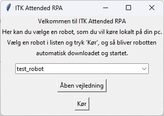

# ITK Attended RPA

## Intro

This project is used to allow ordinary users to run Python based RPA on their local
machines while still maintaining centralized control.
This means that a central admin can add RPAs to a database to control which RPAs
are available to the users.

The user will then have an easy to use GUI application installed on their PC to
start RPAs.

## Installation

### Prerequisites

Users need to have Python installed as well as an ODBC driver matching the
selected database. The installer script in this project will use winget
to install Python and ODBC Driver 17 for SQL Server.

#### Database setup

An admin needs to setup a database with the needed tables. The file `database > schema.sql` provides an SQL script
to create the tables for MSSQL.

### Install from Pypi

To get the app itself you simply install it from pypi:

```bash
pip install itk-attended-rpa
```

### Environment

Users need to have `itk_attended_rpa_conn_String` set in their environment to a valid ODBC connection string.

```bash
Example connection string:
Server=SRVSQLHOTEL04;Database=itk_attended_rpa;Trusted_Connection=yes;Driver={ODBC Driver 17 for SQL Server}
```

## Usage

To launch the app simply call the following command `itk-attended-rpa`.

To activate a robot simply select a robot from the list and press 'Kør'.
You can also press 'Åben vejledning' to show the robot's readme if one exists.



### For admins

The database contains 3 tables:

- __robots__: A list of robots that are available for the users.
  - __name__: The name of the robot.
  - __location_url__: A url where the robot can be downloaded from. This can either be a zip or single python file.
  - __readme_url__: A link to the robot's readme.
- __constants__: A list of name/value constants that will be passed to all robots as a json string.
- __history__: A list of historical robot activations.
